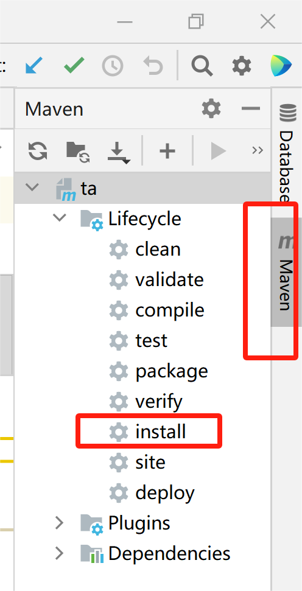
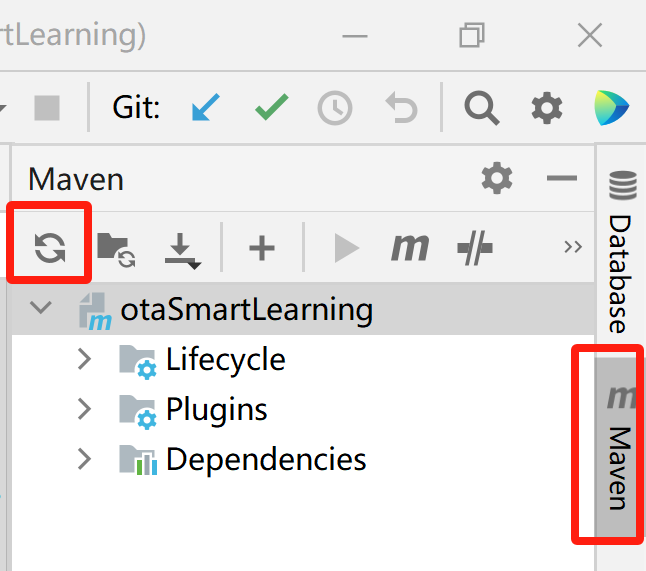

# DTAL

A prototype on learning deterministic timed automata.

# Overview

This tool is used to learn deterministic timed automata (DTAs). We have implemented a prototype named DTAL-Tree in JAVA to learn DTAs based on the classification tree. We compared it with the learning algorithm of DTAs from a powerful teacher proposed in the paper ``Learning deterministic multi-clock timed automata", denoted by DTAL-Table. All evaluations have been carried out on an Intel Core-i7 processor with 32GB RAM.

# Installation 

Prerequisite: JDK 1.8 (or higher), Maven 3.6.3, com.microsoft.z3.jar

Installation: just download.

# Usage


## Take DTAL-Table as an example

To take DTAL-Table as an example, the following steps are required:

1. Open TimedAutomata-main and ttaSmartLearning-main in two windows respectively using IntelliJ IDEA.
2. Use Maven to install TimedAutomata-main by clicking the "Maven" button on the right side of the window and the "install" button in turn. If you encounter an error about lombok during the installation process, check the version of lombok in the pom.xml file of TimedAutomata-main.



3. Open the ttaSmartLearning-main file, refresh Maven by clicking the "Maven" button on the right side of the window and the "Reload" button in turn, and run the main file named ObservationTableExperiment.java in the path Experements/DTAL-Table/ttaSmartLearning-main/src/main/java/Experiment/ObservationTableExperiment.java. 



If you encounter an error about javafx during the running process, add the following codes in the pom.xml file of ttaSmartLearning-main:
```xml
<dependency>
    <groupId>org.openjfx</groupId>
    <artifactId>javafx-controls</artifactId>
    <version>17.0.2</version> 
</dependency>
<dependency>
    <groupId>org.openjfx</groupId>
    <artifactId>javafx-fxml</artifactId>
    <version>17.0.2</version>
</dependency>
<dependency>
    <groupId>org.openjfx</groupId>
    <artifactId>javafx-graphics</artifactId>
    <version>17.0.2</version>
</dependency>
```
If you are operating under Linux, replace the "\\" in each file path of the ObservationTableExperiment.java with "/".

## Take DTAL-Tree as an example:

To take DTAL-Table as an example, the following steps are required:

1. Open TimedAutomata-main and ttaSmartLearning-main in two windows respectively using IntelliJ IDEA.
2. Use Maven to install TimedAutomata-main by clicking the "Maven" button on the right side of the window and the "install" button in turn. If you encounter an error about lombok during the installation process, check the version of lombok in the pom.xml file of TimedAutomata-main.
3. Open the ttaSmartLearning-main file, refresh Maven, and run the main file named TreeExperiment.java in the path Experements/DTAL-Tree/ttaSmartLearning-main/src/main/java/Experiment/TreeExperiment.java. If you encounter an error about javafx during the running process, add the following codes in the pom.xml file of ttaSmartLearning-main:
```xml
<dependency>
    <groupId>org.openjfx</groupId>
    <artifactId>javafx-controls</artifactId>
    <version>17.0.2</version> 
</dependency>
<dependency>
    <groupId>org.openjfx</groupId>
    <artifactId>javafx-fxml</artifactId>
    <version>17.0.2</version>
</dependency>
<dependency>
    <groupId>org.openjfx</groupId>
    <artifactId>javafx-graphics</artifactId>
    <version>17.0.2</version>
</dependency>
```
If you are operating under Linux, replace the "\\" in each file path of the ObservationTableExperiment.java with "/".

## JSON

The target DTA is stored in a JSON file, in this example, example.json. The details are as follows.

```json
{
  "name": "6_1_8_2",
  "tran": {
    "0": ["1", "a", "[8,+)", "(6,+)", "n", "r", "4"],
    "1": ["2", "a", "(6,+)", "[0,+)", "r", "n", "2"],
    "2": ["3", "a", "(3,+)", "[3,+)", "n", "n", "2"],
    "3": ["4", "a", "[0,+)", "(5,+)", "r", "r", "5"],
    "4": ["5", "a", "[7,+)", "(8,+)", "r", "r", "6"],
    "5": ["6", "a", "[6,+)", "(2,+)", "r", "r", "6"]
  },
  "init": "1",
  "accept": ["1", "6"],
  "l": ["1", "2", "3", "4","5","6"],
  "sigma": ["a"]
}
```

"name" : the name of the target DTA;

"l" : the set of the name of locations;

"sigma" : the alphabet;

"tran" : the set of transitions in the following form:

transition id : [name of the source location, action, guard of the first clock, guard of the second clock, reset information of the first clock, reset information of the second clock, name of the target location];

"+" in a guard means INFTY​;

"r" means resetting the clock, "n" otherwise.

"init" : the name of initial location;

"accept" : the set of the name of accepting locations.

# Output

#Membership:  the number of membership queries

#Equivalence:  the number of equivalence queries

#Rest: the number of reset information queries

#M_opt: the number of membership queries conducted in tree operations or table operations

#M_ctx: the number of membership queries conducted during counterexample analysis

Time: runtime for learning a DTA
