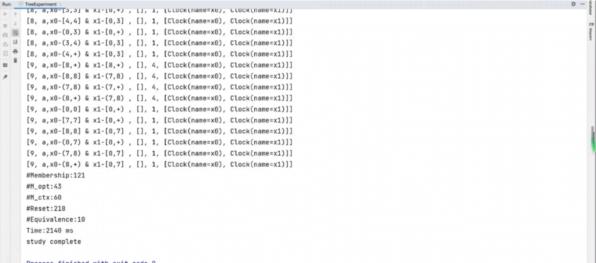
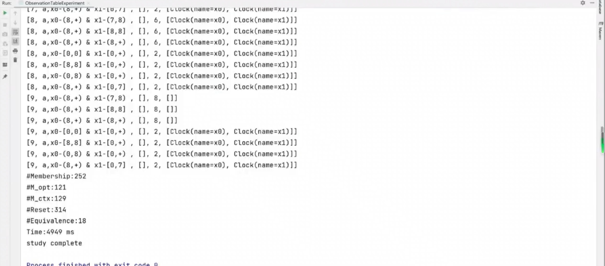

# DTA-Learn

We will make our code publicly available after the paper is accepted.

# Case

As an example, we show the learning results for a DTA as follows.
{

    "name": "8_1_8_2",
    
    "tran": {
        "0": ["1", "a", "[3,+)", "[5,+)", "r", "r", "5"],
        "1": ["2", "a", "(2,+)", "[5,+)", "n", "n", "2"],
        "2": ["3", "a", "[0,+)", "(3,+)", "r", "r", "6"],
        "3": ["4", "a", "(2,+)", "[4,+)", "r", "r", "8"],
        "4": ["5", "a", "(0,+)", "[2,+)", "r", "r", "3"],
        "5": ["6", "a", "[2,+)", "(7,+)", "n", "n", "4"],
        "6": ["7", "a", "(2,+)", "[0,+)", "r", "n", "4"],
        "7": ["8", "a", "[8,+)", "[7,+)", "n", "r", "6"]
    },
    "init": "1",
    
    "accept": ["1","6","8"],
    
    "l": ["1", "2", "3", "4", "5", "6", "7", "8"],
    
    "sigma": ["a"]
}

```

"name" : the name of the target DTA;

"l" : the set of the name of locations;

"sigma" : the alphabet;

"tran" : the set of transitions in the following form:

transition id : [name of the source location, action, guard of the first clock, guard of the second clock, reset information of the first clock, reset information of the second clock, name of the target location];

"+" in a guard means INFTY​;

"r" means resetting the clock, "n" otherwise.

"init" : the name of initial location;

"accept" : the set of the name of accepting locations.


The result learnt by DTAL-Tree is as follow:




The result learnt by DTAL-Table is as follow:



